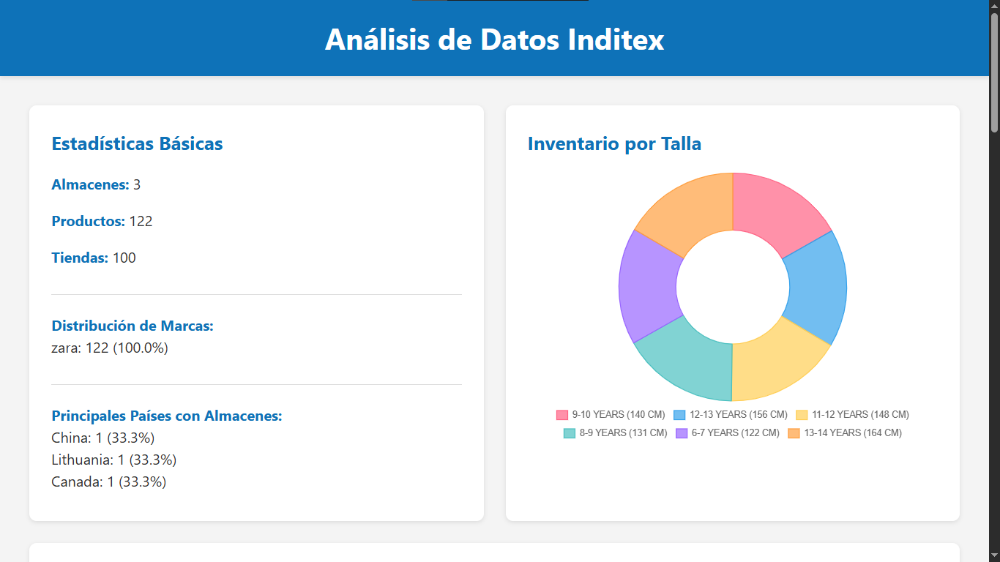

# Inditex Data Visualization

Una aplicación web simple en Flask que visualiza datos de Inditex, mostrando estadísticas sobre almacenes, productos y tiendas.



---
## Características

- Panel de estadísticas básicas
- Visualización de inventario por talla
- Top 10 productos por cantidad de inventario
- Interfaz de consulta con IA (Gemini)
- Insights generados por IA

## Instalación

1. Clona el repositorio
2. Instala las dependencias:

```bash
pip install -r requirements.txt
```

3. Configura la API de Gemini:
   - Crea un archivo `.env` en la raíz del proyecto
   - Añade tu clave API: `GEMINI_API_KEY=tu_clave_api_aqui`
   - Puedes obtener una clave API en: [Google AI Studio](https://makersuite.google.com/)

## Uso

1. Ejecuta la aplicación Flask:

```bash
python app.py
```

2. Abre tu navegador y ve a `http://127.0.0.1:5000`

## Estructura de Datos

La aplicación utiliza tres archivos de datos JSON:

- `data/warehouses.json`: Contiene información sobre almacenes, incluyendo su ubicación e inventario
- `data/products.json`: Contiene detalles de productos, incluyendo información de marcas
- `data/stores.json`: Contiene información de tiendas

## Script de Análisis

También puedes ejecutar el script de análisis independiente para ver las estadísticas en la consola:

```bash
python analyze.py
```

## Consultando con Gemini AI

La aplicación incluye una interfaz para realizar consultas con IA sobre los datos. Puedes preguntar cosas como:

- "¿Cuál es la talla más común en inventario?"
- "¿Cuántos productos hay de la marca zara?"
- "¿Qué productos tienen mayor inventario?"

